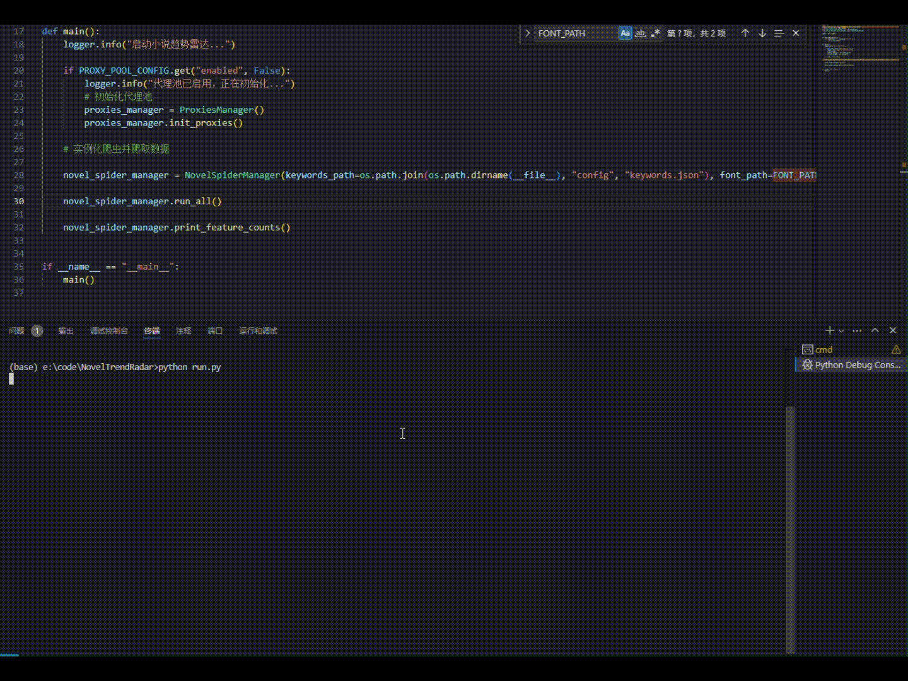

# 🚀 NASA - Novel Analytics & Spider Automation

**NASA** 是一个用于小说网站榜单数据的爬取与分析系统，自动抓取热门书籍榜单、提取关键词与简介内容，并生成可视化词云图，帮助你快速掌握当前小说圈的流行趋势。

> “我们不只探索宇宙，也探索小说的宇宙。”

---

## ✨ Features

- 📈 自动化抓取小说网站（如番茄小说）的排行榜数据
- 🔍 解析小说标题、简介、类型等核心字段
- 🧠 提取关键词，统计频率，生成热词排行
- ☁️ 自动生成词云图，展示当前小说主题风向
- 🌐 支持代理池切换，适配反爬机制
- 🧩 模块化设计，易于扩展更多站点与分析方法

---

## ⚡ Quick Start

### 1. 克隆仓库

```bash
git clone https://github.com/your-username/NASA.git
cd NASA
```

### 2. 安装依赖

```bash
pip install -r requirements.txt
```

### 3. 运行主程序

```bash
python run.py
```

---

## 🗂 Project Structure

```
NASA/
├── run.py                      # 启动入口
├── requirements.txt
├── README.md
│
├── config/                     # 配置文件目录
│   ├── keywords.json           # 关键词（同义词）列表
│   ├── spiders_config.yaml     # 爬虫启用设置
│   └── settings.py             # 系统设置
│
├── nasa_core/                  # 核心功能模块
│   ├── analyzer.py             # 热词提取与词云分析
│   ├── base_spider.py
│   ├── novel_spider_manager.py
│   └── proxies_manager.py
│
├── spiders/                    # 实际爬虫实现
│   ├── novel_sites/            # 小说网站的爬虫
│   └── proxy/                  # 代理的爬虫或API请求类
│
└── utils/
    └── logger.py
```

---

## 🛠 Usage Examples

### 示例：

```bash
python run.py
```



---

## 📌 TODOs

* [ ] 支持更多小说站点（如起点√、番茄√、纵横等）
* [ ] 增加小说标签分类聚合统计
* [ ] 增加CLI工具，支持命令行参数（选择站点等）
* [ ] 支持 GUI 或 Web Dashboard 可视化界面
* [ ] 容器化自动部署 + 定时任务支持

---

## 🤝 Contributing

欢迎提出 Issue、提交 PR 或优化爬虫逻辑：

1. Fork 本仓库
2. 创建新分支 `git checkout -b feature/your-feature`
3. 提交更改 `git commit -m 'add feature'`
4. 推送到分支 `git push origin feature/your-feature`
5. 发起 Pull Request 🎉

---

## 📄 License

MIT License.
Feel free to use, modify, distribute with attribution.

---

## 📬 联系作者

- GitHub: [@BoundlessLearning](https://github.com/BoundlessLearning)
- Email: peripateticism233@163.com

---

> 如果你觉得本项目有趣，欢迎点个 ⭐Star 鼓励作者持续探索小说宇宙！
